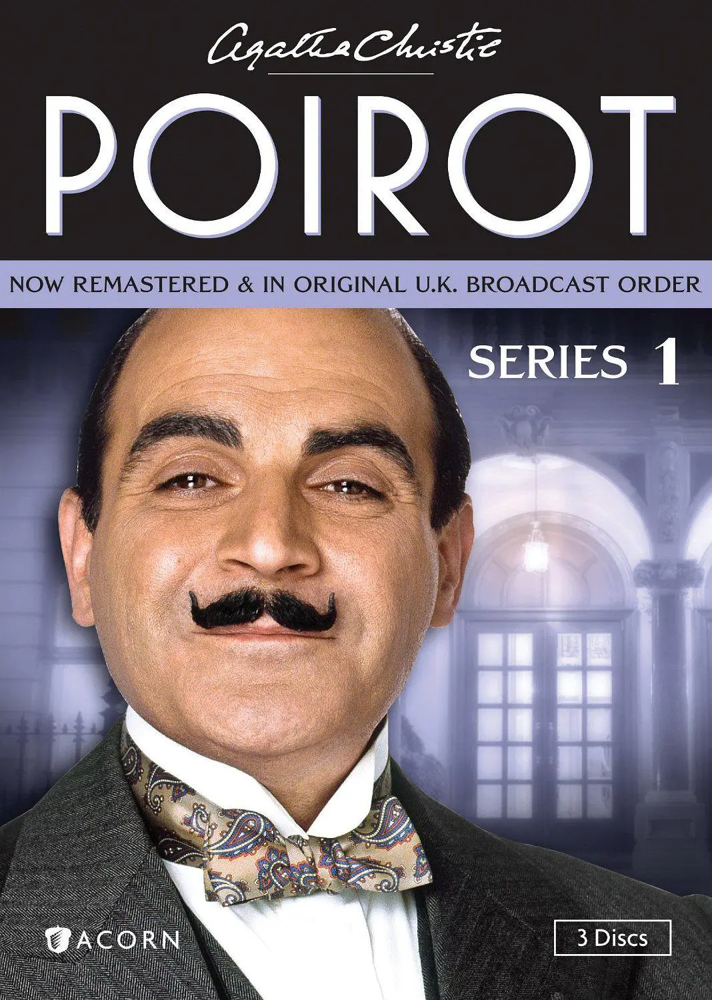
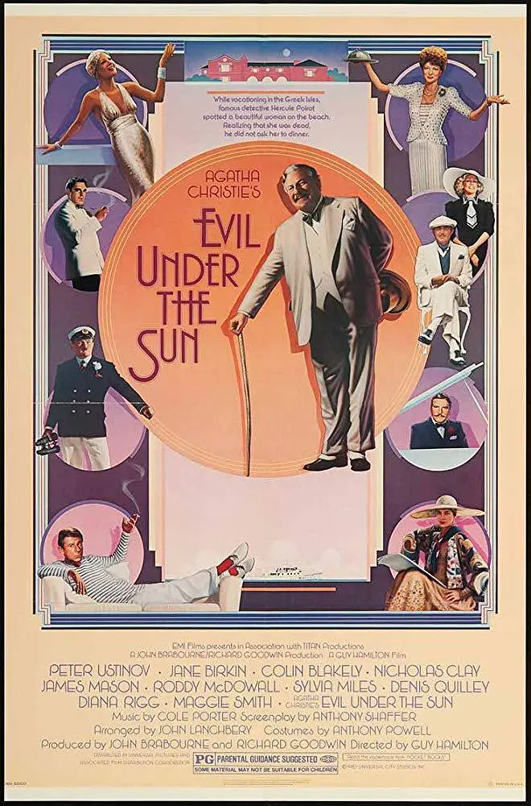

Hercule Poirot（赫尔克里·波洛）是 Agatha Christie （阿加莎·克里斯蒂）笔下著名的侦探角色。阿加莎在中文互联网上被亲切的称呼为阿婆，被誉为举世公认的侦探推理小说女王。阿婆总共创作了66部长篇侦探小说以及14部短篇故事集，其中33部长篇小说的主角是波洛。之前看了一些比较现代的英文通俗小说，而阿婆的主要创作年代是1920年到1975年，属于20世纪中叶的近代通俗小说。离我们的生活更远，所以一些生活的细节上比现代的小说更难理解。看之前担忧侦探小说看得不懂，会不会不能理解剧情。实际看的时候发现，侦探小说中的线索会被反复提及，所以会有利于理解剧情。基本上看下来觉得还算轻松。

波洛形象上以华丽的八字胡出名，并且经常打理他的胡子，身型矮胖，脑袋形状像鸡蛋。爱好干净整洁，不喜欢运动，性格上自我中心。口头禅包括"the little grey cells"、"order and method"、"the psychology of crime"，喜欢通过聊天来获得看似无关紧要的线索，会通过搭建纸牌屋来整理思绪。出场就是一个退休的比利时警察，一战时作为难民到了英国当起了侦探。

阿婆的小说故事性很强，所以有很多的影视改编。其中David Suchet（大卫·苏切）版的电视剧集Agatha Christie's Poirot（大侦探波洛）改编了全部33本长篇小说和大部分短片故事。从1989年第一季到2013年第十三季总共13季70集。其中第一、二、三、五季总共38集，除了第二季的第一集和最后一集之外的36集是短篇故事改编，每集50分钟。这些短篇故事主要选自四本故事集Poirot Investigates（首相绑架案/波洛探案集）、Poirot's Early Cases（蒙面女人/波洛的早期案件）、Murder in the Mews and Other Stories（幽巷谋杀案）、The Adventure of the Christmas Pudding （雪地上的女尸）。第十三季第四集的The Labours of Hercules（赫尔克里的丰功伟绩）也是一本短篇故事集，从其中选出了五个短篇故事合成的长篇电视，剩下33集都是长篇小说改编，长篇基本上在90到100分钟每集。剧集基本上是比较忠实于原著的，短篇加了些情节填充时长，长篇会删减一些配角和支线压缩时长。目前我看完了第一季到第八季，以及第十二季，总共九季53集，剩余四季17集。

除了这个版本的剧集以外，还有日本的动画片《名侦探波洛和马普尔小姐》39集以及法国的《阿加莎·克里斯蒂小型谋杀剧场》三季48集。这两部都并不限于 Poirot 的故事。

电影方面最出名的是彼得·乌斯蒂诺夫出演的六部《尼罗河上的惨案》、《阳光下的罪恶》、《人性记录》、《古宅迷踪》、《三幕悲剧》、《死亡约会》。同时期还有1974年版的《东方快车谋杀案》

最近几年肯尼思·布拉纳自导自演了三部《东方快车谋杀案》、《尼罗河上的惨案》、《威尼斯惊魂夜》。BBC出品了几部迷你剧，主要由编剧莎拉·菲尔普斯(Sarah Phelps)改编包括《无人生还》、《控方证人》、《无妄之灾》、《ABC谋杀案》、《灰马酒店》。

S03E04 Wasps' Nest（蜂窝谜案）

阿婆主要还是长篇比较精彩，因为能有时间去铺垫，去介绍嫌疑人，短篇大部分不太出彩。其中我个人比较喜欢的是蜂窝谜案，阻止一场尚未发生的谋杀案，剧情上不好聊太多，因为侦探小说，说了全是剧透。

S04E01 ABC Murders（ ABC谋杀案）

阿婆的代表作之一，除了剧集以外，有BBC版的迷你剧。迷你剧中 Poirot 是一个被人遗忘的退休侦探，所以这部有非常阴沉的气质，这种气质到还是挺符合那个时代的。这个改编试图抢戏，但是这本作为代表作剧情上就非常出彩，抢戏抢不过就很尴尬。这本在日本动画剧集里面是在5-8集。

S02E01 Peril at End House（悬崖山庄奇案）

这一本是我个人挺喜欢的，我觉得是非常典型的阿婆小说，在前期给出很多看起来难以解释的线索，通过一些支线的线索干扰混淆主线的线索，最后对这些线索给出一个比较合理的解释。这本在日本动画剧集里面是在16-18集。

S07E01 The Murder of Roger Ackroyd （罗杰疑案）

阿婆的成名作，属于不太好改编的，所以只有剧集改编了。作为波洛出场的第三部作品，就已经开始悠闲的退休生活了，但是之后又敬业的工作了四十多年。

S07E02 Lord Edgware Dies（人性记录）

这一部主要通过替身混淆视听。彼得·乌斯蒂诺夫版的电影中，大卫·苏切出演了贾普探长，所以这一部电影是两代波洛同框。

S08E01 Evil Under the Sun（阳光下的罪恶 ）

当全员不在场证明。彼得·乌斯蒂诺夫版的电影中，加了挺多的细节铺垫。

S08E02 Murder in Mesopotamia（美索不达米亚谋杀案 ）

独特的发生在中东的考古背景。阿婆第二任丈夫是考古学家，所以作品里面关于考古方面的背景还挺多的。

S12E02 Three Act Tragedy（三幕悲剧）

《三幕悲剧》的英版动机和美版不同，个人觉得英版的动机不够合情理，更喜欢美版的动机。彼得·乌斯蒂诺夫版的电影用的是美版动机，也有做美国化的改编。剧集则是用的英版的动机。

S12E03 Hallowe'en Party（万圣节前夜的谋杀案）

最近新出肯尼思·布拉纳版的威尼斯惊魂夜由这部小说改成，但是完全大改，估计阿婆都不认识了。

S12E04 Murder on the Orient Express（东方快车谋杀案）

东快作为阿婆代表作，有大量的影视改编，主要看了五个版本。74版的电影比较还原原著，并且演员阵容豪华。2001版将背景改到了现代，做了些细节背景上的调整。肯尼思·布拉纳版的一贯喜欢加戏，不过影片视觉效果不错。剧集版加了对于正义的探讨。日版将背景改到了日本，并且演绎了背后的故事， 不过波洛演得有些让人讨厌。

